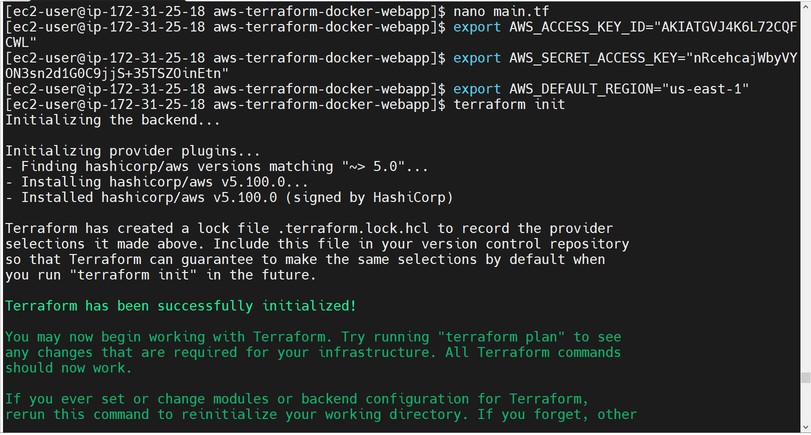
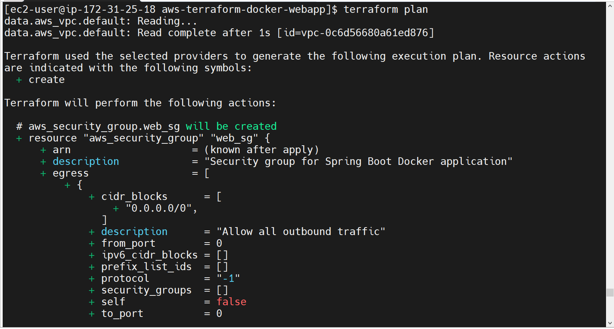
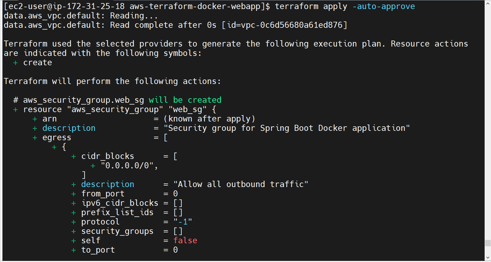
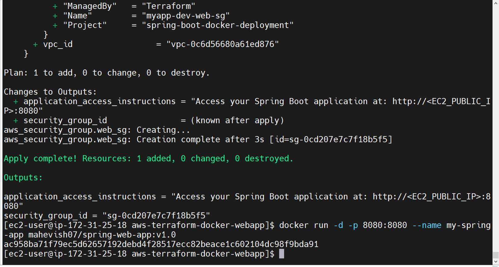
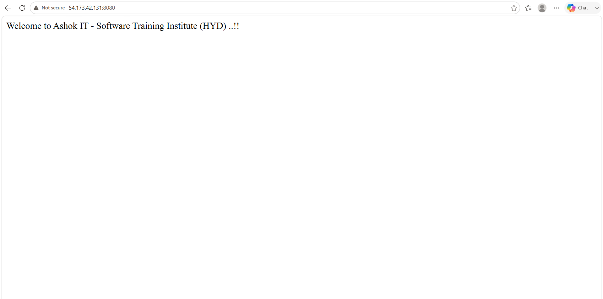

# Spring Boot Deployment on AWS using Docker & Terraform

A professional DevOps workflow demonstrating the automated provisioning of AWS infrastructure using Terraform and containerized application deployment with Docker on an AWS EC2 instance.

## 📌 Architecture & Workflow
1. **Application**: Java Spring Boot web application built using Maven (`./mvnw`).
2. **Containerization**: Dockerized application packaged into a lightweight image (`mahevish07/spring-web-app:v1.0`).
3. **Infrastructure as Code (IaC)**: Provisioned custom AWS Security Groups (`myapp-dev-web-sg`) dynamically mapping HTTP (8080) and SSH (22) traffic using **Terraform**.
4. **Cloud Execution**: Hosted on Amazon Linux 2023 EC2 (`t2.micro`).

---

## 🚀 Getting Started

### Prerequisites
* AWS Account with configured IAM credentials.
* Terraform installed.
* Docker engine installed and running.

### Step 1: Build the Application
```bash
./mvnw clean package

Step 2: Build Docker Image
docker build -t mahevish07/spring-web-app:v1.0 .

Step 3: Provision Infrastructure with Terraform
terraform init
terraform plan
terraform apply -auto-approve

Step 4: Run the Application Container
docker run -d -p 8080:8080 --name my-spring-app mahevish07/spring-web-app:v1.0

Access the live application at: http://<YOUR_EC2_PUBLIC_IP>:8080

🛠️ Key Technologies Used
Java / Spring Boot - Application framework

Docker - Containerization tool

Terraform - Infrastructure as Code (IaC)

AWS (EC2 & VPC) - Cloud Hosting infrastructure

Git / GitHub - Version Control

---

## 🖼️ Screenshots

**1. AWS Infrastructure Provisioning**


**2. Docker Container Running on EC2**


**3. Spring Boot Web Page Access**


**4. Deployment Verification & Logs**


**5. Architecture Output**



